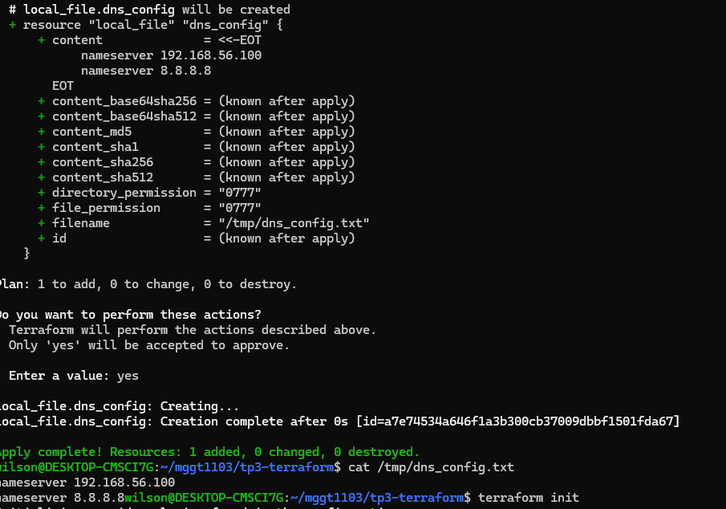

# Rapport du TP n-3

# 1. La différence entre l'approche déclarative et l'approche impérative de l'IaC

L'approche impérative consiste à décrire étape par étape les actions que l'ordinateur doit exécuter pour créer une infrastructure. À l'inverse, l'approche déclarative consiste à décrire uniquement l'état final souhaité de l'infrastructure, sans préciser les étapes nécessaires pour y parvenir. L'outil d'IaC, comme Terraform, se charge ensuite de déterminer automatiquement les opérations à effectuer pour atteindre cet état. Cette approche est généralement plus simple, plus fiable et plus facile à maintenir.

# 2. Capture d'ecran du terminal

# 3. Pourquoi est-il extrêmement dangereux d'envoyer le fichier terraform.tfstate sur un dépôt public ?

Le fichier terraform.tfstate contient l'état complet de l'infrastructure gérée par Terraform. Il peut renfermer des informations très sensibles telles que les adresses IP des serveurs, les identifiants des ressources cloud, les noms des bases de données, ainsi que des secrets ou des clés d'accès si ceux-ci ne sont pas correctement protégés. Si ce fichier est publié sur un dépôt GitHub public, une personne malveillante pourrait récupérer ces informations pour accéder à l'infrastructure, compromettre des services ou lancer des attaques. C'est pourquoi il est recommandé de ne jamais versionner ce fichier dans un dépôt public et de l'ajouter au fichier .gitignore afin d'empêcher son envoi accidentel.
